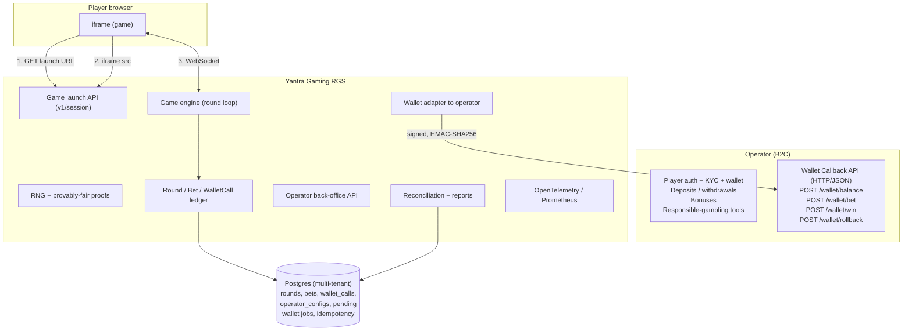
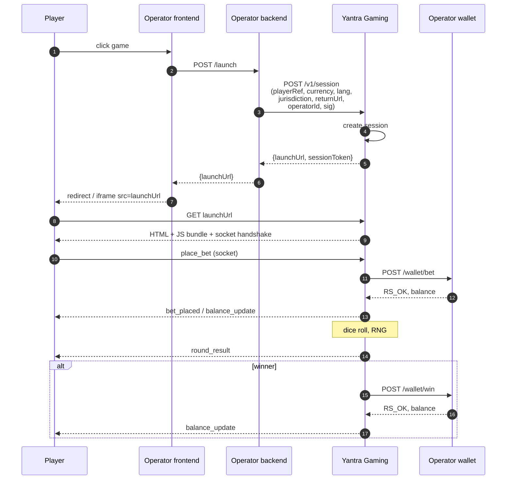

# Yantra Gaming: multi-tenant Remote Gaming Server

> A production-grade, multi-tenant Remote Gaming Server implementing the game-provider role in the B2B iGaming stack. Ships with a plugin-based game layer, first title is **Ketapola Dice** (Sri Lankan LOW/HIGH weighted dice), second is **Crash Minimal** (provably-fair crash, proves the plugin contract works with a different outcome shape); adding a third is a new `games/<code>/` workspace plus one line in the engine registry. This document is the source of truth for the integration surface between operators and the Yantra Gaming engine: the wire contract, the money-safety model, the tenant-isolation model, the round lifecycle, the plugin seam, the auditing and observability envelope, and the operational constraints under which the system ships.
>
> The engineering goal is a system that handles real money against external wallets without losing a cent to retries, crashes, clock skew, duplicates, timeouts, or tenant-cross-talk: idempotent webhooks, append-only audit ledgers, commit-reveal provably fair RNG, crash-safe round lifecycles, signed + replay-protected HTTP, per-operator isolation, durable retry queues, and published SLOs.
>
> **Audience:** operator integration engineers, platform-team owners, certification leads, operations / compliance staff, and reviewers evaluating the design. Read top-to-bottom for a complete picture; jump to §3 for the 60-second version, or §6 for the API surface.

---

## Table of contents

1. [What this is](#1-what-this-is)
2. [Scope, what's in and what isn't](#2-scope--whats-in-and-what-isnt)
3. [Engineering principles](#3-engineering-principles)
4. [Reference architecture](#4-reference-architecture)
5. [Integration model: seamless wallet](#5-integration-model-seamless-wallet)
6. [Core API surface](#6-core-api-surface)
7. [Game launch flow](#7-game-launch-flow)
8. [Round lifecycle (money-safe)](#8-round-lifecycle-money-safe)
9. [Authentication, signing, idempotency, replay protection](#9-authentication-signing-idempotency-replay-protection)
10. [Multi-tenant data model](#10-multi-tenant-data-model)
11. [Operator back-office](#11-operator-back-office)
12. [Provably fair](#12-provably-fair)
13. [Observability & SLOs](#13-observability--slos)
14. [Testing strategy](#14-testing-strategy)
15. [Risk register](#15-risk-register)
16. [Production prerequisites (outside the engineering scope)](#16-production-prerequisites-outside-the-engineering-scope)
17. [Versioning and delivery](#17-versioning-and-delivery)
18. [Repo structure](#18-repo-structure)
19. [Appendix A, Worked wallet-call example](#appendix-a--worked-wallet-call-example)
20. [Appendix B, Worked game-launch example](#appendix-b--worked-game-launch-example)
21. [Appendix C, Glossary](#appendix-c--glossary)

---

## 1. What this is

iGaming has three commercial roles: **operator** (holds the player wallet), **aggregator** (re-sells hundreds of games to operators via one API), and **game provider / studio** (builds the game, consumes the operator's wallet). Yantra Gaming implements the game-provider role.

> **Product surfaces.** The system is composed of three components, all shipped in this repository:
>
> 1. **The core RGS backend** (`apps/rgs-server`), wire contract, wallet adapter, RNG, round engine, data model, portal API, observability, SDK, mock operator. This is the integration surface every operator must consume and the only component whose wire format is part of the SLA.
> 2. **The reference player iframe** (`apps/game-client`, PixiJS), the Yantra game UI, session-token handshake, socket-based round lifecycle, i18n, animation. Operators can run it as-is, white-label it, or bring their own.
> 3. **The operator back-office** (`apps/operator-portal`, React), the admin UI rendered on top of the documented admin API. Operators who prefer their own UI can build against `routes/admin.ts` directly.
>
> The backend wire contract is what binds the SLA; the frontends are reference implementations, useful out of the box, replaceable without touching the SLA surface.

The product unit is:

1. A **game launch URL** the operator calls to mint a session.
2. A **wallet callback API** the operator exposes that the RGS calls during play (`balance`, `bet`, `win`, `rollback`).
3. A **reporting feed** for reconciliation.
4. A **back-office portal** the operator uses to see per-game GGR, RTP drift, incidents, round audits.

Once you're in this role, you **no longer own the wallet**. Every bet and win is a network call to somebody else's system, and that call can fail, time out, duplicate, or come back out of order. The engineering problem this repo solves is: how do you run a real-time gambling game against an external wallet without losing money on rounding errors, retries, or crashes?

---

## 2. Scope: what's in and what isn't

The scope boundary tracks the RGS/operator contract: the RGS owns the game loop, the RNG, the audit ledger, the round lifecycle and the wire contract; the operator owns the wallet, the player identity, and everything regulated-entity-specific.

### In the RGS boundary (built in this system)

- Multi-tenant RGS: N operators, each with their own config, credentials, audit ledger, game state
- Seamless-wallet HTTP integration: `balance / bet / win / rollback` with HMAC-SHA256 signing and strict idempotency
- Plugin-based game layer (`packages/game-contract`): every game implements the same `GamePlugin` interface; the engine is game-agnostic; adding a game is a new `games/<code>/` workspace plus one line in `apps/rgs-server/src/games/registry.ts`. First two titles: `ketapola-dice`, `crash-minimal`.
- Commit-reveal provably fair RNG primitives in `packages/rng-core` (HMAC-SHA256 over `serverSeed + clientSeed + ":" + nonce`), shared by every plugin
- Durable rollback / retry queue for failed settlements
- Crash-safe round state machine with startup recovery
- `PendingRoundBet` register for GLI-19 §3 "incomplete games"
- Operator back-office API (rounds, wallet-calls, sessions, config with audit log, reports, credentials)
- Mock-operator app with toggle-able failure modes for integration tests and partner onboarding
- Operator SDK package (`@yantra/operator-sdk`), `createSession`, `verifyWebhookSignature`, typed error codes
- OpenTelemetry-native metrics, Prometheus `/metrics`, published SLOs
- Reconciliation CLI (`bun run reconcile`) and daily reports (JSON + CSV)
- Per-scope RNG change-gate in CI (`CERT-ATTEST-CORE` for `packages/rng-core`; `CERT-ATTEST-<GAMECODE>` for `games/<code>/src/{outcome,settle,config}.ts`), per-game 10M-round RTP regression under `tests/games/<code>/`, plugin-conformance harness under `tests/plugin-contract/`

### Outside the RGS boundary (operator responsibilities)

These are owned by the operator's Player Account Management platform and are deliberately not touched by the RGS:

- Player authentication, account lifecycle, opaque `playerRef` resolution
- KYC, AML screening, source-of-funds checks
- Deposits, withdrawals, payment rails
- Bonus engine, marketing pixel integrations, loyalty
- Responsible-gambling policy definition. The RGS *enforces* per-session limits delivered via session JWT; the operator *sets* them.
- Real-money custody, the wallet is the operator's system of record for every cent.

The `mock-operator` app exists to drive these integrations end-to-end with a fake SQLite wallet, a fake lobby, and configurable failure modes. It is not a deployment target.

### Compliance deliverables (tracked separately in §16)

These are operational and legal deliverables that sit alongside the engineering, not inside it:

- Jurisdictional licensing (Curaçao B2B Critical Supplier, Malta MGA, UKGC, …)
- Cert-lab submission (iTech Labs / BMM / GLI-11 / GLI-19)
- ISO 27001, SOC 2 Type II, annual pen-test, bug bounty
- Data residency and DR topology per jurisdiction
- MiCA / FATF Travel Rule compliance for crypto-currency configurations

The engineering artefacts each of these programs consumes, platform docs (GLI-19) and per-game cert packets (GLI-11), are all shipped in the repo. Platform scope: `docs/change-management.md`, `docs/threat-model.md`, `docs/provably-fair.md`, `docs/security.md`. Per-game scope: `games/<code>/docs/rng-spec.md`, `games/<code>/docs/par-sheet.md`, `games/<code>/docs/game-rules.md`, `games/<code>/docs/rng-test-vectors.md` + `games/<code>/fixtures/rng-test-vectors.json`. See §12 and each game's `rng-spec.md §9` for the full artefact list.

---

## 3. Engineering principles

The design principles below are the load-bearing ones, each one has a file it lives in and a failure mode it prevents. Skim this table to get the 60-second version of the whole system.

| Principle | Where it lives | Why it matters |
| --- | --- | --- |
| **Idempotency at two levels** | `apps/rgs-server/src/middleware/idempotency.ts`, `InboundIdempotency` model, `transactionUuid` unique constraint on `Bet` | Operators will retry. Network blips happen. Every money-moving request has a `requestUuid` (per-HTTP dedupe) and `transactionUuid` (per-money-movement dedupe). Neither double-charges nor double-pays. |
| **Append-only audit ledger** | `WalletCall` model + wrappers in `HttpWalletAdapter` | Every outbound wallet call writes a row *before* the HTTP request and updates it after. Failed calls, timeouts, latencies, retries, all preserved. This is the reconciliation substrate and the debugging gold mine. |
| **Crash-safe round state machine** | `services/GameEngine.ts`, `Round.settled` flag, startup recovery loop | Server dies mid-settlement? On startup, every round with `settled=false` is resumed: known outcomes retry, unknown outcomes void the round and roll back every accepted bet. |
| **Durable retry queue** | `PendingWalletJob` model + `services/PendingJobRunner.ts` | Failed `win` or `rollback` does not disappear, it is persisted with exponential backoff. Monitored via a dashboard; never swallowed silently. |
| **Multi-tenant isolation** | `operatorId` FK on every domain row; `forOperator(id)` Prisma wrapper on reads and writes; per-operator game-engine instance via `EngineRegistry` | No query can forget the tenant scope. |
| **Commit-reveal provably fair** | `packages/rng-core/src/` (HMAC-SHA256 primitives with `serverSeed + clientSeed + ":" + nonce`), `/v1/rounds/:id/proof` endpoint | Players and operators can verify every outcome after the fact. Server seed is hash-committed at session creation and revealed on rotation. Shared across every game plugin. |
| **Plugin seam between engine and games** | `packages/game-contract/src/index.ts` (`GamePlugin` interface + `GameOutcome` discriminated union), `apps/rgs-server/src/games/registry.ts` | The engine has no game-specific logic; outcomes persist as `{outcomeType, outcomeData}` JSONB; per-game config lives in `OperatorGameConfig.configJson`, validated by `plugin.configSchema` at engine startup. |
| **Signed + replay-protected HTTP** | `utils/signing.ts`, `middleware/operator-auth.ts`, ±30s timestamp window, constant-time compare | Standard HMAC webhook signing (Stripe/GitHub style). Replay attacks blocked by timestamp + idempotency cache. |
| **Integer money throughout** | `BigInt` micro-units (× 100,000), `MICRO_PER_UNIT` in `packages/wallet-spec` | No floats in money code. Wire format is stringified integer. |
| **Change-gated RNG** | CI rule: any PR touching `packages/rng-core/src/` fails without a `CERT-ATTEST-CORE:` line; any PR touching `games/<code>/src/{outcome,settle,config}.ts` fails without a `CERT-ATTEST-<GAMECODE>:` line | Mirrors how cert labs treat RNG changes as re-cert events; scoped per game so a Ketapola edit doesn't re-cert Crash and vice-versa. |
| **Deterministic math regression** | `tests/games/<code>/rtp-regression.spec.ts` runs 10M rounds per game and asserts the observed RTP is within ±0.5% of theoretical | What cert labs actually test. Per-game because each plugin has its own PAR sheet. |
| **Plugin conformance harness** | `tests/plugin-contract/plugin-conformance.spec.ts` runs six architectural checks against every registered plugin | New games that violate the contract fail CI, not at runtime. |
| **OpenTelemetry + published SLOs** | OTel SDK + Prometheus `/metrics`; SLOs documented in `docs/security.md` | 2026 baseline. Vendor-neutral. |

---

## 4. Reference architecture



Two design properties that drive everything else:

1. **The iframe talks to the RGS for game state.** The operator is involved *only* when money moves (balance/bet/win/rollback). The game loop is ours.
2. **The operator's wallet is the source of truth for money.** The RGS never "owns" a balance, it records an immutable log of every wallet call so it can reconcile, but the operator's number is canonical.

This is the Remote Gaming Server pattern: a network-based service that hosts game content and bridges it to operator platforms.

---

## 5. Integration model: seamless wallet

The roadmap ships seamless wallet only. Player balance stays at the operator; the RGS calls the operator's wallet on *every* bet and win. The alternative, transfer wallet, where funds are moved into a game-side sub-balance before play, is a legacy Asian-market pattern with a "stuck funds" failure mode, and can be added later behind the same `WalletAdapter` interface without touching the game engine.

Trade-off: seamless adds network latency to every round. Mitigated by a strict 2-second per-round budget, aggressive 5-second client timeouts, and synthetic-rollback semantics on any non-`RS_OK` / non-reject status.

---

## 6. Core API surface

### 6.1 RGS public API (operator → Yantra)

HTTPS only, HMAC-SHA256 signed. See §9.

| Method | Path | Purpose |
| --- | --- | --- |
| `POST` | `/v1/session` | Create a launch session; returns `launchUrl` + `sessionToken`. |
| `GET` | `/v1/session/:id` | Inspect a session (debug / support). |
| `POST` | `/v1/session/:id/terminate` | Operator-forced termination (self-exclusion, timeout, risk). |
| `GET` | `/v1/rounds/:id` | Full round audit record. |
| `GET` | `/v1/rounds/:id/proof` | Reveal server seed + recompute info. |
| `GET` | `/v1/rounds?operatorId=…&from=…&to=…` | List rounds for reconciliation. |
| `GET` | `/v1/reports/daily?date=…` | Daily GGR / NGR report (JSON + CSV). |
| `GET` | `/v1/config` | Effective operator game config (weights, limits, currencies). |
| `GET` | `/healthz`, `/readyz` | Liveness / readiness. |
| `GET` | `/metrics` | Prometheus metrics. |

### 6.2 Wallet callback API (Yantra → operator)

The operator implements these. The RGS calls them.

| Method | Path (operator-owned) | Purpose | Idempotent? |
| --- | --- | --- | --- |
| `POST` | `/wallet/balance` | Read balance. | N/A (read) |
| `POST` | `/wallet/bet` | Debit stake. | **Yes**: same `transactionUuid` returns same result |
| `POST` | `/wallet/win` | Credit payout. References bet's `transactionUuid`. | **Yes** |
| `POST` | `/wallet/rollback` | Reverse a previous `bet` or `win`. References original `transactionUuid`. | **Yes** |

Error codes are standardised in `packages/wallet-spec`. The critical classifier rules:

- `RS_OK` → committed.
- `RS_ERROR_NOT_ENOUGH_MONEY`, `RS_ERROR_LIMIT_REACHED`, `RS_ERROR_USER_DISABLED` → bet cleanly rejected; **do not rollback**, do not retry.
- `RS_ERROR_DUPLICATE_TRANSACTION` → operator already processed this tx, treat as success.
- Everything else (including our synthetic `RS_ERROR_TIMEOUT`) → uncertain; fire `POST /wallet/rollback` with the same `transactionUuid`, enqueue retry with exponential backoff.

---

## 7. Game launch flow



Session tokens are short-lived JWTs (≤ 60 min) bound to one player + one game + one currency. See `apps/rgs-server/src/routes/session.ts` for the actual implementation.

---

## 8. Round lifecycle (money-safe)

`apps/rgs-server/src/services/GameEngine.ts` implements the state machine:

```
PENDING → BETTING_OPEN → ROLLING → RESULT → SETTLED
                              │
                              └─ (any failure after bets accepted) → VOIDED
```

Each transition is *money-safe against an external wallet*. The rules:

### Bet placement

```
on place_bet(playerRef, side, amount):
  txId = uuid()
  persist WalletCall(OUTBOUND, BET, requestUuid, transactionUuid=txId, attempt=1)  # ← before
  result = wallet.bet(operatorId, playerRef, amount, txId, roundId)
  update WalletCall(response)                                                      # ← after

  if isReject(result):           emit 'bet_rejected'; return
  if !isSuccessOrDuplicate(result):
    enqueue rollback(txId)        # fire-and-retry in background
    emit 'bet_rejected'; return

  persist Bet(roundId, playerRef, amount, txId, status=ACCEPTED)
  persist PendingRoundBet(bet, state=HELD)                                         # ← GLI-19 §3
  emit 'bet_placed'
```

### Round roll

```
on round_roll(roundId):
  dice = rng.determineOutcome(serverSeed, clientSeed, nonce, lowWeight, highWeight)
  persist Round.outcome = dice
  emit 'round_result'
```

### Settlement

```
on round_settle(roundId):
  for each winning Bet:
    txId = uuid()
    persist WalletCall(OUTBOUND, WIN, requestUuid, transactionUuid=txId)
    result = wallet.win(operatorId, playerRef, payout, txId, refTxId=bet.txId, roundId)
    if !isSuccessOrDuplicate(result):
      enqueue PendingWalletJob(WIN, bet, payload)     # ← retry queue
      mark bet.status = FAILED
    else:
      mark bet.status = SETTLED
      transition PendingRoundBet → RESOLVED

  mark Round.settled = true
```

### Crash recovery

On server startup, the engine scans for rounds where `settled=false`:

- **Outcome known** → retry settlement of each ACCEPTED bet via `PendingWalletJob`.
- **Outcome unknown** → void the round, roll back every ACCEPTED bet, transition `PendingRoundBet` → REFUNDED.

Two invariants that fall out:

1. **Every wallet call is journalled before the HTTP request fires.** If the process dies mid-call, the row exists on restart; recovery can query the operator or issue a rollback with the known `transactionUuid`.
2. **Every failed settlement enters a retry queue with an alert.** No failed `win` is ever swallowed. `wallet_call_failures_total{status="win"}` pages on any non-zero rate.

---

## 9. Authentication, signing, idempotency, replay protection

### Operator credentials

When an operator is onboarded:

- `operatorId`: opaque public identifier.
- `kid` / `apiSecret`: HMAC-SHA256 credentials for their inbound requests to the RGS.
- `walletCallbackUrl`: base URL they expose the wallet API on.
- `walletSignatureKid` / `walletSignatureSecret`: HMAC credentials used on outbound calls to their wallet.
- IP allow-list (optional).

Secrets are encrypted at rest (AES-GCM via `utils/secrets.ts`) and stored in `OperatorCredential.cipherBlob`.

### Request signing (symmetric HMAC-SHA256)

Every signed request carries:

```
X-Yantra-Key-Id:   <kid>
X-Yantra-Timestamp: <unix seconds>
X-Yantra-Signature: base64(HMAC_SHA256(secret, method + "\n" + path + "\n" + timestamp + "\n" + sha256(body)))
```

On receipt (`middleware/operator-auth.ts`):

1. Reject if `|now - timestamp| > 30s`: replay guard.
2. Recompute signature, constant-time compare (`crypto.timingSafeEqual`).
3. Reject if `requestUuid` has been seen before, inbound idempotency cache, keyed on `(operatorId, endpoint, requestUuid)`, 24h TTL.

This is the Stripe / GitHub / Shopify webhook-signing pattern. Nothing invented.

### Session tokens (player-scope)

JWTs signed with the RGS secret, claims:

```json
{
  "sub":         "opaque-player-ref",
  "operatorId":  "op_abc123",
  "sessionId":   "5bb8…",
  "currency":    "LKR",
  "jurisdiction":"LK",
  "lang":        "si",
  "mode":        "real",
  "rgLimits":    { "dailyLossMicro": "5000000000", "dailyWagerMicro": "20000000000", "sessionTimeSeconds": 3600 },
  "iat": 1745400000,
  "exp": 1745403600
}
```

The socket handshake uses this token in `socket.handshake.auth.token`. Middleware scopes every read and write to `operatorId` + `sessionId`.

### Idempotency: two keys, two purposes

- `requestUuid`: per-HTTP-request dedupe (prevents double-processing a retried request).
- `transactionUuid`: per-money-movement dedupe (prevents two *different* HTTP requests both settling the same round).

Both are persisted. The `WalletCall` table has a unique constraint on `(operatorId, direction, endpoint, requestUuid)`; the `Bet` table has unique constraints on each of `betTransactionUuid`, `winTransactionUuid`, `rollbackTransactionUuid`.

### Forward path: asymmetric JWT for launch requests

HS256 session JWTs are fine for the RGS-internal session token. For the **operator → RGS launch request**, the next iteration is RS256 / ES256 with a JWKS URL stored on `OperatorCredential`: the operator signs with their private key, the RGS verifies with a public key fetched and cached from their JWKS endpoint. This eliminates the shared-secret risk and hardens against algorithm-confusion attacks (CVEs that downgrade RS256 to HS256 by flipping the `alg` header, still observed in 2026). The RGS hardcodes an algorithm allowlist per credential.

---

## 10. Multi-tenant data model

Every domain row carries `operatorId`. The Prisma schema lives in `apps/rgs-server/prisma/schema.prisma`. High-level shapes:

- `Operator`: the tenant.
- `OperatorCredential`: encrypted API / wallet secrets, rotatable via `notBefore` / `notAfter` / `revokedAt`.
- `OperatorUser`: human logins for the back-office portal.
- `OperatorGameConfig`: per-operator game config (weights, min/max bet, betting window, currency).
- `OperatorConfigAuditLog`: every config change, by whom, when, old→new.
- `GameSession`: one per player × currency × game, short-lived, holds `serverSeed` / `serverSeedHash` / `clientSeed` / `nonce`.
- `Round`: one per spin, snapshots seed state at creation, tracks `state` and `settled`.
- `Bet`: one per player bet in a round, 1-to-1 with operator-side transaction IDs.
- `WalletCall`: append-only audit log, one row per outbound or inbound wallet call, captures request, response, latency, attempt number.
- `PendingRoundBet`: separate register required by GLI-19 §3 for bets on in-flight or interrupted rounds; states `HELD`, `RESOLVED`, `REFUNDED`.
- `PendingWalletJob`: durable retry queue for failed `win` or `rollback` calls.
- `InboundIdempotency`: 24h cache of inbound request responses, keyed on `(operatorId, requestUuid, endpoint)`.

### Isolation levers

1. **Row-level filtering in every query** via a `forOperator(id)` Prisma wrapper, centralised so no query can forget it.
2. **Per-operator game-engine instance**: `EngineRegistry` maintains one round loop per (operator × currency), not one global loop.

Per-operator schemas or databases would be a Phase-B-only concern (white-label / hyper-regulated markets) and are not implemented here.

---

## 11. Operator back-office

> **Reference implementation.** The back-office web UI (`apps/operator-portal`, React) ships in this repo as a reference admin, ready to run, white-label, or fork. The admin API it renders, `routes/admin.ts`, `routes/admin-auth.ts`, `middleware/portal-auth.ts`, `OperatorConfigAuditLog`: is documented and stable; operators who prefer their own UI (many do, for brand or SSO reasons) can build directly against the documented endpoints without touching the portal.

`apps/operator-portal/` is multi-tenant, scoped to a single `operatorId` per logged-in `OperatorUser`, with `KETAPOLA_STAFF` as the cross-operator super-admin role. Pages that ship:

| Page | What operators do here |
| --- | --- |
| **Overview** | KPIs: today's bets, wins, GGR, NGR, active sessions, settlement status. |
| **Game Config** | Per-currency min/max bet, weights, betting windows, enable/disable. Every change writes `OperatorConfigAuditLog`. |
| **Rounds** | Searchable list with drill-down: round detail reveals full proof (seeds, bets, outcome, payouts). |
| **Wallet Calls** | Per-operator log of every bet/win/rollback/balance call, failed calls, latency, retries, response bodies. |
| **Sessions** | Active and recent player sessions, `playerRef`, currency, start/end, bets, net position. |
| **Reports** | Daily / weekly / monthly JSON + CSV downloads: GGR, NGR, hold %, RTP actual vs expected, volume. |
| **Credentials** | Rotate API keys and wallet HMAC secrets; configure IP allow-list. |

Stack: React + Vite, TanStack Table for grids, Recharts for analytics. Same stack as `apps/game-client`, so a frontend engineer can contribute to either without a context switch.

---

## 12. Provably fair

Every round is externally verifiable. The scheme:

```
outcome = HMAC_SHA256( serverSeed, clientSeed + ":" + nonce )
  first 4 bytes → side (LOW/HIGH) via weighted threshold
  next  4 bytes → face within side (mod faces_per_side)
```

Where:

- `serverSeed`: 32 random bytes generated server-side, hash-committed at session creation (`serverSeedHash = SHA256(serverSeed)` sent to the client in the session response). Revealed via `/v1/rounds/:id/proof` after the seed rotates or the session ends.
- `clientSeed`: provided by operator or player at session creation, or auto-generated by the RGS. Rotating it rotates the server seed.
- `nonce`: session-scoped, increments per round.

Verification snippet (provided to operators in `docs/provably-fair.md`):

```js
import crypto from 'node:crypto';

function verify({ serverSeed, clientSeed, nonce, lowWeight, highWeight }) {
  const hmac = crypto.createHmac('sha256', serverSeed)
    .update(`${clientSeed}:${nonce}`)
    .digest('hex');
  const sideValue = parseInt(hmac.slice(0, 8), 16);
  const threshold = (lowWeight / (lowWeight + highWeight)) * 0xffffffff;
  const side = sideValue < threshold ? 'LOW' : 'HIGH';
  const faceValue = parseInt(hmac.slice(8, 16), 16);
  const faces = side === 'LOW' ? [3, 6, 9] : [12, 15, 18];
  return { side, sum: faces[faceValue % faces.length] };
}
```

Implementation split across `packages/rng-core/src/index.ts` (shared commit-reveal primitives: `roundHmac`, `generateSeedPair`, `verifyServerSeed`) and `games/<code>/src/outcome.ts` (per-game mapping, e.g. `games/ketapola-dice/src/outcome.ts` for the LOW/HIGH weighted dice). Any change to the primitives invalidates every game's RNG certification; any change to a game's outcome mapping invalidates that game's certification. CI guards both with per-scope attestations (`CERT-ATTEST-CORE`, `CERT-ATTEST-<GAMECODE>`).

---

## 13. Observability & SLOs

### OpenTelemetry-native

The RGS is instrumented with `@opentelemetry/sdk-node` + auto-instrumentation for HTTP and Prisma. Traces, metrics, and logs flow over OTLP, no vendor lock-in. Export to any backend (Grafana, Datadog, Honeycomb, local Jaeger).

### Custom metrics

| Metric | Labels | Meaning |
| --- | --- | --- |
| `wallet_call_latency_ms` | `operator`, `endpoint`, `status` | Histogram of outbound wallet-call latencies. |
| `wallet_call_errors_total` | `operator`, `endpoint`, `rs_status` | Counter of non-OK wallet responses. Alert on non-zero rate for `endpoint="win"`. |
| `bet_to_settlement_ms` | `operator`, `game_code` | End-to-end bet → settlement histogram. |
| `rtp_actual_rolling_24h` | `operator`, `game_code`, `currency` | Rolling 24h RTP. Fires alert at ±3σ from theoretical. |
| `pending_wallet_jobs` | `operator`, `endpoint` | Gauge of stuck retry-queue entries. Alert if > 5 min old. |
| `session_active` | `operator` | Gauge of live sessions per operator. |
| `round_state_transitions_total` | `operator`, `from_state`, `to_state` | Round-lifecycle counter. |

Prometheus endpoint at `GET /metrics`.

### Published SLOs

These would be contractual in a real deployment. In this repo they are budgets the CI load test checks against.

| SLO | Target |
| --- | --- |
| `POST /wallet/bet` outbound p99 | < 300 ms |
| `POST /wallet/bet` outbound p99.9 | < 800 ms |
| Bet → settlement end-to-end p99 | < 1.5 s |
| `POST /v1/session` inbound p99 | < 150 ms |
| Error budget on `/wallet/bet` | 0.1 % / 30 d |
| Round-state-machine uptime | 99.9 % / 30 d |

### RTP drift monitor

A scheduled job computes rolling 24h actual RTP per `(operator, game_code, currency)` and fires an alert if |actual − theoretical| > 3σ. Catches bugs, bot farms, weight-config typos, and RNG regressions in one signal.

---

## 14. Testing strategy

| Test type | Where | What it covers |
| --- | --- | --- |
| **Unit** | `apps/rgs-server/src/**/*.spec.ts` | Signing, idempotency cache, money conversion, classifier helpers, RNG determinism |
| **Integration, money safety** | `tests/integration/` | The four tests every RGS needs: `wallet-rollback.spec.ts`, `idempotency.spec.ts`, `timeout-retry.spec.ts`, `settlement-failure.spec.ts` |
| **Math regression** | `tests/games/<code>/rtp-regression.spec.ts` (per game) | 10M-round simulation per game. Asserts observed RTP is within ±0.5 % of theoretical for the declared config. Re-runs on any edit to `packages/rng-core/src/` (all games) or the game's own `outcome.ts` / `settle.ts` / `config.ts`. |
| **Plugin conformance** | `tests/plugin-contract/plugin-conformance.spec.ts` | Six architectural checks run against every plugin registered in `apps/rgs-server/src/games/registry.ts`. A plugin that violates the contract fails CI. |
| **Contract** | `packages/wallet-spec/test/` | The wire format is stable, `toMicro` / `fromMicro` roundtrip, status-code classifiers |
| **Load** | `tests/load/k6-bet-flow.js` | 100-VU bet/win/rollback loop for 5 min. Measures the SLO table. |
| **End-to-end** | `tests/e2e/mock-operator.spec.ts` | Spin up rgs + mock-operator, drive a session through iframe handshake → bet → win |

What the **money-safety** integration tests specifically assert:

- **`wallet-rollback`**: repeated `/wallet/rollback` with the same `transactionUuid` is a no-op at the operator; the RGS `WalletCall` row records the retry count; the final result is exactly one reverse entry.
- **`idempotency`**: two POSTs with identical `requestUuid` but different bodies return the cached response for the first body, and never second-effect.
- **`timeout-retry`**: a simulated operator that returns 503 twice then 200 still settles the bet via `PendingWalletJob`, with exponential backoff, and monotonically increasing attempt numbers in `WalletCall`.
- **`settlement-failure`**: killing the rgs-server process after a round resolves but before every bet is settled, and restarting it, produces exactly the right number of `win` calls (no duplicates, no missed settlements).

---

## 15. Risk register

Ordered by how often they bite real iGaming shops:

| Risk | How it manifests | Mitigation in this repo |
| --- | --- | --- |
| **Double-settlement** | Network blip → retry `/wallet/win` → operator credits twice. | Unique `transactionUuid` per movement; operator dedupes; every attempt in `WalletCall`. |
| **Orphaned debits** | Called `/wallet/bet`, timed out, operator *did* debit, rollback fails. | Rollback retry queue with exponential backoff + alert > 5 min stuck. Daily reconciliation. |
| **Round half-settled** | Server crashes between settling player A and player B of the same round. | `Round.settled=false` + startup resume. Idempotent per-bet. |
| **RTP drift** | Bug or weight-config typo silently shifts RTP. | Rolling 24h RTP monitor; CI math regression; change-gated `rng.ts`. |
| **Clock skew replay** | Operator's clock drifts → signed requests rejected, or replayed ones accepted. | ±30s window; alert on sustained > 10s skew. |
| **Leaked operator secret** | Secret exfiltrated from env. | Secrets encrypted at rest (AES-GCM); rotation via `OperatorCredential.notBefore/notAfter/revokedAt`; IP allow-list per operator. |
| **Session token reuse** | Same token used across players. | Bound to `(operatorId, sessionId, playerRef)`; single-use creation; max-concurrent-sessions config. |
| **Under-funded wallet** | Operator has a bad day; lots of wins fail. | Circuit breaker per operator: after N consecutive non-OK on `/wallet/win`, stop accepting new bets from that operator, alert both sides. |
| **Certification drift** | Shipped code change that invalidates RNG assumptions. | CI rule: PR touching `rng.ts` or weight config fails without an attestation + a fresh 10M-round pass. |
| **Stuck-rollback tail** | A handful of operators can't process rollbacks; pile up. | `PendingWalletJob` "stuck > 24h" alert + manual reconciliation tool in portal. |
| **Dispute with no audit trail** | Player claims they won; no proof. | `Round.serverSeed` + `clientSeed` + `nonce` + `outcome` + both `transactionUuid`s always preserved; public proof URL. |

---

## 16. Production prerequisites (outside the engineering scope)

Shipping the engine is a necessary condition for go-live, not a sufficient one. The deliverables below are operational, legal, and compliance milestones owned by the business, they sit alongside the codebase, not inside it. The engineering artefacts each program consumes (RNG source + spec, PAR sheet, change-management policy, threat model, audit ledger, observability evidence) are shipped in the repo; the submissions and sign-offs are not.

### Licensing

- **Curaçao B2B Critical Supplier**: the cheapest path to a legal operator relationship. The **Landsverordening op de Kansspelen (LOK)** entered into force **24 Dec 2024**; the B2B Critical Supplier license becomes **mandatory on 24 Dec 2026** (two-year transition window). Today the repository sits inside that window: legacy sub-licensees remain valid until transition close; new B2B suppliers are encouraged to apply directly. Costs (2026 fee schedule): **EUR 4,592 application + EUR 24,490 annual supervisory + Curaçao-domiciled entity + resident director**. Plan a 3–4 month review cycle.
- **Malta MGA B2B Critical Gaming Supply**: EU passporting; 6–12 month compliance lift. The **Player Protection Directive** was materially updated in **Jan 2024** (traceable processes, automated player-risk monitoring, KYC+ obligations). MGA's 2025 supervisory direction is evidence-based risk-based oversight, the `WalletCall` ledger + OTel traces are the evidence substrate.
- **UKGC Gambling Software License**: only if a UK-licensed operator asks. **UKGC remote game design changes** took effect **17 Jan 2025**: autoplay, quick-spin, slam-stop, and turbo prohibited (already enforced in `jurisdiction-rules`); mandatory minimum **2.5-second spin cycle**; mandatory stake limits (**£5/spin for 25+, £2/spin for 18–24**); compulsory game timers and net-position display. The `jurisdiction-rules` GB profile applies £2 globally as a conservative default, operators can raise for verified 25+ players via `OperatorGameConfig.maxBetMicro`.
- **Ontario AGCO Registrar's Standards**: iGaming Ontario became an independent agency in **May 2025**; AGCO **Standards 2.10 / 2.11** updated **Jun 2025** mandate data-driven player-risk monitoring and timely intervention. The RG-limits enforcer + RTP-drift monitor cover the technical surface; operator-portal supplies the intervention UI.
- **Germany (GGL)**: GlüStV 2021 §§ 6c, 22a. Self-exclusion via **OASIS** (≈ 350k registrations by 2025); per-player deposit caps enforced centrally via **LUGAS** (Länderübergreifendes Glücksspielaufsichts-system), the RGS surfaces the OASIS/LUGAS hooks to the operator-owned wallet at session create; enforcement of the monthly €1,000 cap lives in the operator wallet, not here.
- **Brazil (SPA)**: Law 14.790/2023 and Normative Ordinances (SPA/MF 722 / 827 / 1,330 / 1,475). Regulation effective **1 Jan 2025**; SPA-recognised cert labs: **GLI, BMM, iTech Labs, Trisigma, Quinel, eCOGRA**. Mandatory platform + per-game certification, **ISO/IEC 27001 infrastructure**, facial-recognition KYC on the operator side, and `.bet.br` domain. The `BR` profile ships in `packages/jurisdiction-rules` (BRL only, no crypto, no demo mode without KYC, 2s spin floor, autoplay / turbo prohibited, mandatory reality-check + net-loss display).

### Certification

- **RNG certification** (iTech Labs / BMM / GLI). Inputs needed are all already in the repo: RNG source, math model, PAR sheet, architecture diagram, change-management policy.
- **Game math / PAR sheet** independent review.
- **GLI-11** for each individual game in each regulated market.
- **GLI-19** for the platform, required for white-label / multi-game shape.

### Security programs

- **ISO/IEC 27001**: shortens jurisdictional reviews; required by German market among others.
- **SOC 2 Type II**: expected by US enterprise operators.
- **Annual independent pen-test** + public bug bounty program.
- **WAF + DDoS protection** (Cloudflare / Fastly / equivalent), table stakes; a 5-minute outage during a tournament ends a contract.

### Operator-facing capabilities the RGS would still own

- **Self-exclusion check hook** (per-jurisdiction: **GAMSTOP** for UK, **OASIS + LUGAS** for Germany, **RGIAJ** for Spain, **SPELPAUS** for Sweden, **iGO-SE** for Ontario, **MGA-SE** for Malta, central portal for Portugal). **GamProtect SCV** (GAMSTOP-operated industry single customer view, 2024/25 BGC pilot) is the emerging cross-operator layer in the UK, operators will be expected to query it alongside GAMSTOP on session create. The session-create flow carries a `selfExclusionRegistryResponse` claim on the JWT so the RGS can surface a `session_blocked_self_excluded` rejection without a round-trip.
- RG limit enforcement from session JWT (already implemented in this repo).
- Operator-triggered session termination (`POST /v1/sessions/:id/terminate`).
- 5- to 7-year append-only log retention (varies by jurisdiction; `WalletCall` + `Round` are the substrate). GDPR Article 17 ("right to erasure") vs GLI-19 retention is resolved by `playerRef`-level pseudonymisation: the RGS only ever stores the opaque `playerRef`, never the player's personally identifiable information, deletion of PII in the operator wallet leaves the audit trail intact and non-attributable.

### Data residency

Per jurisdiction, real deployments have to think about primary + replica + DR topology. E.g. Germany requires ISO-27001-certified DC in-country; Malta requires replication of critical data to Malta-approved DC. Multi-region Postgres with read replicas covers most of the spread.

### Crypto / stablecoin wallets

If an operator wants to integrate on-chain stablecoins (USDC, USDT), MiCA compliance (EU) and FATF Travel Rule (global) come into scope. The `OperatorGameConfig` schema would grow a per-currency `micaCompliant` flag so USDT configurations can be gated pending issuer approval.

---

## 17. Versioning and delivery

The wire contract (`packages/wallet-spec`), the session JWT claim set, and the admin API are versioned independently from the engine internals. Breaking changes to any of the three require a major bump and a deprecation window documented in `docs/change-management.md`.

### Shipped in v1.0 (current)

**Tenancy + data model**: multi-model Postgres schema under `apps/rgs-server/prisma/schema.prisma`: `Operator`, `OperatorCredential`, `OperatorUser`, `OperatorGameConfig` (with JSONB `configJson`), `OperatorConfigAuditLog`, `GameSession`, `Round` (outcomes stored as `{outcomeType, outcomeData}` JSONB, no game-specific columns), `Bet`, `PendingRoundBet`, `WalletCall`, `PendingWalletJob`, `InboundIdempotency`, plus jurisdiction / cert / signing-key / MFA / webhook / audit-chain tables. Row-level tenant scoping via `forOperator(id)` Prisma wrapper. Per-`(operator, game, currency)` engine instance via `EngineRegistry`. AES-GCM at-rest encryption for credentials with `notBefore`/`notAfter`/`revokedAt` rotation.

**Plugin-based game layer**: `packages/game-contract` defines the `GamePlugin` interface + `GameOutcome` discriminated union; `packages/rng-core` holds the shared provably-fair primitives (`generateSeedPair`, `roundHmac`, `verifyServerSeed`); `apps/rgs-server/src/games/registry.ts` statically wires plugins by `gameCode`. Two reference plugins ship: `games/ketapola-dice/` (Sri Lankan LOW/HIGH weighted dice, 2× symmetric payout) and `games/crash-minimal/` (provably-fair crash, proves the contract works with a different outcome shape). Per-game config is validated at engine startup by `plugin.configSchema` against `OperatorGameConfig.configJson`. Adding a third game is a new `games/<code>/` workspace plus one line in the registry.

**Money-safe wallet layer**: `WalletAdapter` interface with `HttpWalletAdapter` (HMAC-SHA256 outbound, ±30s replay window, timeout→synthetic-rollback) and `InternalWalletAdapter` (in-process fake used by the e2e suite). `WalletClient` circuit breaker wraps both. `InboundIdempotency` cache (24h TTL). `PendingWalletJob` durable retry queue with exponential backoff. Full `WalletCall` ledger with pre-request write and post-response update.

**Round lifecycle**: `services/GameEngine.ts` implements the plugin-driven `PENDING → BETTING_OPEN → ROLLING → RESULT → SETTLED / VOIDED` state machine with startup crash-recovery. `PendingRoundBet` register for GLI-19 §3 incomplete-games tracking. `services/SessionService.ts` manages session creation, rotation, and termination.

**Provably fair**: `packages/rng-core` commit-reveal primitives (HMAC-SHA256 over `serverSeed + clientSeed + ":" + nonce`), `services/ProofService.ts`, public `GET /v1/rounds/:id/proof`, seed rotation on session boundary or explicit request. Every plugin uses the same `roundHmac` so the proof shape is identical across games.

**Security hardening**: HSTS + CSP at the Express layer; per-operator rate limiting (`middleware/operator-rate-limit.ts`); IP allow-list (`middleware/ip-allow-list.ts`); geo allow-list (`middleware/geo-allowlist.ts`); operator-gate middleware for ACTIVE-status enforcement; role-gate middleware (`middleware/role-gate.ts`) for `KETAPOLA_STAFF` / operator-role scoping; Turnstile on portal login (`middleware/turnstile.ts`); constant-time HMAC compare; per-scope RNG change-gate CI job.

**Responsible gambling**: `services/RGLimitsEnforcer.ts` enforces per-session limits (daily loss, daily wager, session duration) delivered via the session JWT claim set at bet time.

**Portal API + admin surface**: 11 route modules under `src/routes/`: `session`, `rounds`, `reports`, `webhooks`, `admin`, `admin-auth`, `platform`, `jwks`, `health`, `metrics`, plus the `index.ts` mount. 11 middleware modules covering operator auth, session auth, portal auth, platform auth, role-gate, idempotency, rate limits, IP allow-list, geo allow-list, operator-gate, and Turnstile.

**Observability**: OpenTelemetry SDK + auto-instrumentation for HTTP and Prisma; Prometheus `/metrics`; custom histograms and counters for wallet-call latency, wallet-call errors, bet→settlement, pending jobs, session active counts, round-state transitions, and rolling 24h RTP drift (tagged per `(operator, game_code, currency)`).

**Reconciliation + reporting**: `services/ReconciliationJob.ts` + `scripts/reconcile.ts` CLI; daily / weekly / monthly reports in JSON and CSV; per-operator `/v1/rounds?…`, `/v1/reports/daily?…` endpoints.

**Testing**: unit coverage across signing, money conversion, classifier helpers, RNG determinism. Money-safety integration specs under `tests/integration/` (`wallet-rollback`, `idempotency`, `timeout-retry`, `settlement-failure`, `webhooks`, `audit-chain`, `cert-upload`, `credential-rotation`, `global-kill-switch`, `jurisdiction-rules`, `mfa`, `signing-keys`) plus a shared `harness.ts`. E2E spec under `tests/e2e/mock-operator.spec.ts` driving the real Express + Socket.IO stack. Plugin-conformance harness under `tests/plugin-contract/plugin-conformance.spec.ts`: six architectural checks against every registered plugin, fails CI on violations. Per-game RTP regression under `tests/games/<code>/rtp-regression.spec.ts` (10M rounds) plus per-game `rng-test-vectors.spec.ts` where applicable. Contract tests under `packages/wallet-spec/test/`. k6 load harness under `tests/load/k6-bet-flow.js`.

**Documentation**: split by cert scope, matching the GLI-19 (platform) vs GLI-11 (per-game) submission boundary:

- **Platform docs** (GLI-19 scope, one copy for the whole RGS) under `docs/`: `integration-guide`, `wallet-api`, `provably-fair` (shared commit-reveal scheme), `error-codes`, `architecture`, `change-management`, `runbook`, `threat-model`, `incidents`, `security`, `observability`.
- **Per-game cert packets** (GLI-11 scope, one set per plugin) under `games/<code>/docs/`: `game-rules.md`, `par-sheet.md`, `par-sheet.json` (machine-readable), `rng-spec.md`, `rng-test-vectors.md`. Canonical test vectors as JSON live at `games/<code>/fixtures/rng-test-vectors.json` so the test harness and the cert packet read the same bytes. Submission packets are assembled by `scripts/export-cert-packet.ts <game-code>`.

**Reference integration tooling**: `apps/mock-operator` with toggle-able failure modes (timeout, 5xx, duplicate, not-enough-money, network partition) under `src/wallet/` and `src/lobby/`; reads `MOCK_OPERATOR_GAME_CODE` env to swap which game it launches. `packages/operator-sdk` with `createSession.ts`, `verifyWebhook.ts`, `errors.ts`, and TypeScript types. Shared wire contracts in `packages/wallet-spec/src/index.ts` and `packages/webhook-spec/src/index.ts`. Shared jurisdiction rule set in `packages/jurisdiction-rules`.

**CI + supply chain**: `.github/workflows/ci.yml` (Biome check, full-workspace typecheck, Prisma validate + migrate deploy, full test run, CycloneDX SBOM upload on `main`, per-scope RNG change-gate job that enforces `CERT-ATTEST-CORE` for `packages/rng-core/` edits and `CERT-ATTEST-<GAMECODE>` for each `games/<code>/src/{outcome,settle,config}.ts` edit). `.github/workflows/rtp-regression.yml` (weekly 10M-round per-game RTP simulations, Sunday 04:00 UTC). `.github/workflows/dco.yml` (Signed-off-by check on every PR commit). `LICENSE`, `SECURITY.md`, `CHANGELOG.md`, and PR template.

### Planned for v1.1

- **RS256 + JWKS launch and wallet signing.** Operator → RGS launch JWTs signed with the operator's private key, verified via a JWKS URL on `OperatorCredential`. Algorithm allowlist per credential to block alg-confusion downgrades. HS256 path stays available during the deprecation window. Extends to the outbound wallet direction for operators migrating from the Hub88 RSA-SHA256 convention, HMAC-SHA256 remains the default.
- **Auto-generated SDKs from OpenAPI.** The OpenAPI 3.1 spec (`docs/openapi.yaml`) ships today; what's planned for v1.1 is the CI generation pipeline for **Python, PHP, Java, .NET** SDKs via `openapi-generator`, CI-gated so the published SDKs cannot drift from the spec. TypeScript SDK remains hand-written. Postman collection auto-exported from the same spec.
- **Transfer-wallet adapter.** A second `WalletAdapter` implementation for operators that require the transfer-wallet pattern (primarily Asian-market). Implements the same interface, no game-engine changes.
- **Multi-region Postgres.** Warm standby + documented DR runbook. Target RPO < 5 min, RTO < 30 min. Driven by data-residency requirements in Germany / Malta / Brazil deployments (§16).
- **Per-operator database isolation.** Opt-in for white-label and hyper-regulated tenants, selected via `OperatorCredential.dbSchema`. The row-level-scoped default remains the norm.
- **WebAuthn for portal users.** Hardware-key second factor for `OperatorAdmin` and `YantraStaff` roles.
- **Dispute-pack endpoint.** `GET /v1/rounds/:id/dispute-pack` returns a signed zip: `Round` + `Bet[]` + `WalletCall[]` + RNG proof + PAR-sheet excerpt + manifest. Complements the existing `/v1/rounds/:id/proof` (RNG verification only) with the settlement trace regulators / players / arbitrators actually need.

### Planned for v2

- **GLI-19 §4 platform submission.** Engineering artefacts already shipped (multi-game plugin architecture, conformance harness, per-game RTP regressions); submission is queued once two games are GLI-11-certified and in live operation with paying operators.
- **Third game plugin + partner onboarding.** A third production game behind the same `GamePlugin` contract, candidate slots pencilled for a slot-style and a Keno-style title. Exercises the plugin seam against a richer outcome shape.
- **gRPC alongside HTTP.** For operators running co-located infra who want to trim the wallet-call tail latency below the current ±300 ms p99 target.
- **Event-sourced WalletCall log.** Migrating the append-only ledger to a log-structured store (e.g. Kafka → Postgres projection) for operators whose volume makes the row-level ledger hot.

---

## 18. Repo structure

```
yantra-gaming/
├── package.json                         # Bun workspace root (apps/*, packages/*, games/*)
├── bun.lock
├── .tool-versions                       # Bun version pin (also enforced in CI)
├── docker-compose.yml                   # postgres for local dev
├── tsconfig.base.json
├── B2B_ROADMAP.md                       # this file
├── CLAUDE.md                            # repo guidance (hard rules, commands, key files)
├── README.md
├── CHANGELOG.md
├── SECURITY.md
├── LICENSE                              # Apache-2.0
├── mkdocs.yml                           # MkDocs + Material config, renders docs/ +
│                                        #   games/<code>/docs/ to a static site
├── requirements-docs.txt                # pinned MkDocs toolchain (consumed by CI)
│
├── .github/
│   ├── workflows/
│   │   ├── ci.yml                       # build + test + SBOM + per-scope RNG change-gate
│   │   ├── rtp-regression.yml           # weekly 10M-round per-game RTP simulations
│   │   ├── docs.yml                     # build + deploy MkDocs site to GitHub Pages
│   │   └── dco.yml                      # Signed-off-by verification
│   └── PULL_REQUEST_TEMPLATE.md
│
├── scripts/
│   ├── reconcile.ts                     # daily settlement reconciliation CLI
│   ├── generate-test-vectors.ts         # regenerates games/<code>/fixtures/rng-test-vectors.json
│   ├── export-cert-packet.ts            # assembles a per-game GLI-11 submission zip
│   └── kill-ports.ts                    # dev-port cleanup wrapping `bun run dev`
│
├── apps/
│   ├── rgs-server/                      # the RGS, core product, backend
│   │   ├── src/
│   │   │   ├── index.ts
│   │   │   ├── config.ts
│   │   │   ├── db.ts
│   │   │   ├── logger.ts
│   │   │   ├── seed.ts                  # demo-operator / demo-user seeder
│   │   │   ├── games/registry.ts        # static GamePlugin map, add a line per new game
│   │   │   ├── routes/                  # 11 route modules:
│   │   │   │                            #   index, session, rounds, reports, webhooks,
│   │   │   │                            #   admin, admin-auth, platform, jwks,
│   │   │   │                            #   health, metrics
│   │   │   ├── middleware/              # 11 middleware modules:
│   │   │   │                            #   operator-auth, session-auth, portal-auth,
│   │   │   │                            #   platform-auth, role-gate, idempotency,
│   │   │   │                            #   operator-rate-limit, operator-gate,
│   │   │   │                            #   ip-allow-list, geo-allowlist, turnstile
│   │   │   ├── services/                # game engine + platform services:
│   │   │   │                            #   GameEngine, EngineRegistry, SessionService,
│   │   │   │                            #   ProofService, PendingJobRunner,
│   │   │   │                            #   ReconciliationJob, RGLimitsEnforcer,
│   │   │   │                            #   AuditChain, AdminAuditLog, CertRegistry,
│   │   │   │                            #   CertStorage, ClockSkewMonitor,
│   │   │   │                            #   CredentialRotation, DisputePack,
│   │   │   │                            #   GlobalKillSwitch, Mfa, SigningKeys,
│   │   │   │                            #   UserInvites, Webauthn, WebhookDispatcher,
│   │   │   │                            #   BuildAttestation
│   │   │   ├── wallet/                  # 6 files:
│   │   │   │                            #   WalletAdapter, HttpWalletAdapter,
│   │   │   │                            #   InternalWalletAdapter, WalletClient,
│   │   │   │                            #   CircuitBreaker, types
│   │   │   ├── socket/gameSocket.ts     # player-iframe socket.io namespace
│   │   │   ├── telemetry/               # OTel init (index.ts) + Prometheus metrics
│   │   │   ├── utils/                   # signing, money, secrets, uuid
│   │   │   │                            # (RNG now lives in packages/rng-core)
│   │   │   └── generated/prisma/        # Prisma client output (git-tracked for CI)
│   │   └── prisma/
│   │       ├── schema.prisma            # multi-tenant schema, outcomes are JSONB,
│   │       │                            #   per-game config is JSONB, no game-specific
│   │       │                            #   columns
│   │       └── migrations/
│   │
│   ├── mock-operator/                   # reference fake casino + fake wallet
│   │   └── src/                         # reads MOCK_OPERATOR_GAME_CODE to pick the game
│   │       ├── server.ts
│   │       ├── config.ts
│   │       ├── lobby/ (router, template)       # fake game lobby
│   │       └── wallet/ (router, store, signing) # fake wallet with failure modes
│   │
│   ├── game-client/                     # reference PixiJS player iframe (see §1)
│   ├── operator-portal/                 # reference React admin back-office (see §1, §11)
│   └── provider-admin/                  # Yantra-staff platform admin UI
│
├── games/                               # per-game plugins, one workspace each
│   │                                    # Each plugin bundles: src/ (code), docs/ (GLI-11
│   │                                    # cert packet: game-rules, par-sheet, rng-spec,
│   │                                    # rng-test-vectors), fixtures/ (machine-readable
│   │                                    # test vectors shared with tests/games/<code>/).
│   ├── ketapola-dice/                   # Sri Lankan LOW/HIGH weighted dice, 2× payout
│   │   ├── src/                         #   index, config, outcome, selection, settle
│   │   ├── docs/                        #   game-rules, par-sheet.md + .json, rng-spec,
│   │   │                                #   rng-test-vectors.md
│   │   └── fixtures/                    #   rng-test-vectors.json (canonical)
│   └── crash-minimal/                   # provably-fair crash (validates the plugin seam)
│       ├── src/                         #   index, config, outcome, selection, settle
│       ├── docs/                        #   same cert-packet layout (pre-cert status)
│       └── fixtures/                    #   rng-test-vectors.json (TBD before submission)
│
├── packages/
│   ├── game-contract/                   # GamePlugin interface + GameOutcome union
│   │   └── src/index.ts
│   ├── rng-core/                        # shared provably-fair primitives
│   │   └── src/                         #   generateSeedPair, roundHmac, verifyServerSeed
│   │                                    #   (CERT-ATTEST-CORE gated in CI)
│   ├── wallet-spec/                     # shared TS types + Zod schemas for the wallet contract
│   │   └── src/index.ts
│   ├── webhook-spec/                    # webhook envelope + signing spec
│   │   └── src/index.ts
│   ├── jurisdiction-rules/              # shared jurisdiction rule set
│   │   └── src/
│   └── operator-sdk/                    # npm package operators install
│       └── src/
│           ├── index.ts
│           ├── createSession.ts
│           ├── verifyWebhook.ts
│           └── errors.ts
│
├── docs/                                # PLATFORM-level documentation (GLI-19 scope)
│   │                                    # Per-game cert packets (GLI-11) live under
│   │                                    # games/<code>/docs/, see that tree above.
│   ├── integration-guide.md             # operator-dev 30-min onboarding
│   ├── wallet-api.md                    # canonical wallet contract
│   ├── provably-fair.md                 # shared commit-reveal scheme + end-user verifier
│   ├── error-codes.md                   # every RS_* code, when it fires, how to handle
│   ├── architecture.md                  # Mermaid: context, container, state, sequence, ER
│   ├── change-management.md             # regated-change policy (per-scope CERT-ATTEST)
│   ├── runbook.md                       # day-2 ops: deploy, env vars, backup, key rotation
│   ├── threat-model.md                  # STRIDE per component, traced to code
│   ├── incidents.md                     # 10 incident playbooks
│   ├── security.md                      # signing, replay, rate limits, SLOs
│   └── observability.md                 # metrics, traces, alert rules
│
└── tests/
    ├── integration/                     # money-safety + platform specs (share harness.ts)
    │   ├── harness.ts
    │   ├── wallet-rollback.spec.ts
    │   ├── idempotency.spec.ts
    │   ├── timeout-retry.spec.ts
    │   ├── settlement-failure.spec.ts
    │   ├── webhooks.spec.ts
    │   ├── audit-chain.spec.ts
    │   ├── cert-upload.spec.ts
    │   ├── credential-rotation.spec.ts
    │   ├── global-kill-switch.spec.ts
    │   ├── jurisdiction-rules.spec.ts
    │   ├── mfa.spec.ts
    │   └── signing-keys.spec.ts
    ├── plugin-contract/
    │   └── plugin-conformance.spec.ts   # six architectural checks across every plugin
    ├── games/                            # per-game math (matches games/<code>/)
    │   ├── ketapola-dice/
    │   │   ├── rtp-regression.spec.ts   # 10M-round RTP simulation
    │   │   └── rng-test-vectors.spec.ts # determinism vs fixed vectors
    │   └── crash-minimal/
    │       └── rtp-regression.spec.ts
    ├── e2e/
    │   └── mock-operator.spec.ts        # real Express + Socket.IO, drives a live session
    └── load/
        └── k6-bet-flow.js               # 100-VU bet/win/rollback, 5 min
```

Lint / format is Biome (`bun run check`), not ESLint. Tooling is deliberately single-vendor for the whole workspace, one config, one command, identical in CI and locally.

---

## Appendix A: Worked wallet-call example

A player bets 1,000.00 LKR on LOW, wins with 3× (the LOW/HIGH symmetric payout).

### 1. Bet

Request (RGS → operator):

```http
POST /wallet/bet HTTP/1.1
Host: casino.example.com
Content-Type: application/json
X-Yantra-Key-Id: kid_0a1b2c
X-Yantra-Timestamp: 1745400000
X-Yantra-Signature: <base64 hmac>

{
  "requestUuid":      "c4a8e2b6-1f3a-4a0e-9b5c-1b2c3d4e5f60",
  "transactionUuid":  "a1b2c3d4-5678-90ab-cdef-111122223333",
  "operatorId":       "op_abc123",
  "playerRef":        "op-player-7712",
  "currency":         "LKR",
  "amountMicro":      "100000000",          // 1,000.00 LKR × 100_000
  "gameCode":         "ketapola-dice",
  "roundId":          "round_0193fe…",
  "isFree":           false,
  "meta":             { "side": "LOW", "clientSeed": "op-provided-seed" }
}
```

Response:

```json
{
  "status":       "RS_OK",
  "requestUuid":  "c4a8e2b6-1f3a-4a0e-9b5c-1b2c3d4e5f60",
  "balanceMicro": "900000000",
  "currency":     "LKR"
}
```

### 2. Win (dice = 9, LOW wins, payout = 3,000.00 LKR)

```http
POST /wallet/win
…

{
  "requestUuid":              "7f9c…",
  "transactionUuid":          "44445555-…",
  "referenceTransactionUuid": "a1b2c3d4-5678-90ab-cdef-111122223333",
  "operatorId":               "op_abc123",
  "playerRef":                "op-player-7712",
  "currency":                 "LKR",
  "amountMicro":              "300000000",
  "gameCode":                 "ketapola-dice",
  "roundId":                  "round_0193fe…",
  "meta":                     { "outcome": "LOW", "sum": 9 }
}
```

### 3. Rollback (hypothetical: operator crash between bet and win)

```http
POST /wallet/rollback

{
  "requestUuid":              "rb-1…",
  "transactionUuid":          "rb-tx-1…",
  "referenceTransactionUuid": "a1b2c3d4-5678-90ab-cdef-111122223333",
  "operatorId":               "op_abc123",
  "playerRef":                "op-player-7712",
  "currency":                 "LKR",
  "gameCode":                 "ketapola-dice",
  "roundId":                  "round_0193fe…"
}
```

Operator restores stake; round marked voided in Yantra; `PendingRoundBet` transitions to REFUNDED.

---

## Appendix B: Worked game-launch example

Operator backend (using the SDK):

```ts
import { createSession } from '@yantra/operator-sdk';

const { launchUrl, sessionToken } = await createSession({
  endpoint:  'https://rgs.yantra.example/v1/session',
  apiKeyId:  process.env.YANTRA_KEY_ID!,
  apiSecret: process.env.YANTRA_API_SECRET!,
  payload: {
    operatorId:   'op_abc123',
    playerRef:    player.id,
    gameCode:     'ketapola-dice',
    currency:     'LKR',
    lang:         'si',
    jurisdiction: 'LK',
    mode:         'real',
    returnUrl:    'https://casino.example.com/lobby',
    rgLimits:     { dailyLossMicro: '5000000000' },
  },
});

res.redirect(launchUrl);
```

RGS verifies HMAC + timestamp + idempotency, creates `GameSession`, responds:

```json
{
  "sessionId":      "5bb8…",
  "sessionToken":   "ey…",
  "launchUrl":      "https://rgs.yantra.example/game/ketapola-dice/v1/?sessionToken=ey…&lang=si",
  "expiresAt":      "2026-04-23T09:00:00Z",
  "serverSeedHash": "c2a71…"
}
```

Player browser loads the iframe; the game-client reads `sessionToken` from the query string and establishes the socket handshake. From there the existing socket flow runs, scoped to this operator + player + session.

---

## Appendix C: Glossary

- **RGS**: Remote Gaming Server. The product in this architecture.
- **PAM**: Player Account Management. The operator's core platform (wallet, KYC, bonuses).
- **Aggregator**: B2B intermediary that resells many studios' games to many operators via one API.
- **GGR / NGR**: Gross Gaming Revenue (bets − wins) / Net Gaming Revenue (GGR − bonuses − taxes).
- **Hold / house edge**: percent of GGR the operator keeps long-run.
- **RTP**: Return To Player, `1 − house edge`. Published as certified.
- **Seamless wallet**: every transaction goes to the operator in real time. Modern default.
- **Transfer wallet**: funds moved to game-side pot before play; reconciled later. Legacy.
- **PAR sheet**: Probability Accounting Report. Documents every outcome's probability and payout.
- **GLI-11 / GLI-19 / GLI-33**: Gaming Laboratories International cert standards: game device / interactive system / event wagering.
- **Provably fair**: commit-reveal with `serverSeed` (hashed pre-round, revealed post-round), `clientSeed`, `nonce`; `outcome = HMAC_SHA256(serverSeed, clientSeed:nonce)`.
- **Idempotency key**: a client-supplied UUID the server uses to deduplicate retried requests.
- **Circuit breaker**: pattern for quickly failing requests to a dependency that's known to be broken, to avoid cascading failure.
- **Error budget**: the fraction of requests allowed to fail under an SLO. Burn rate is watched as a leading indicator.
