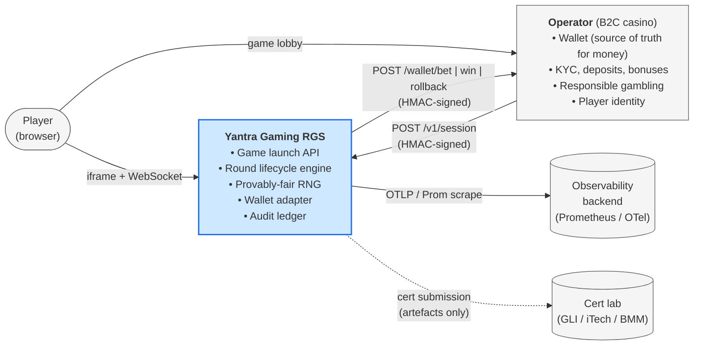
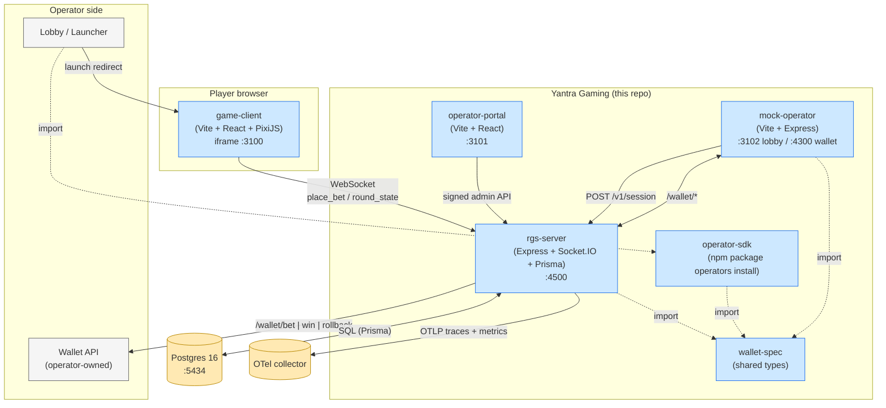
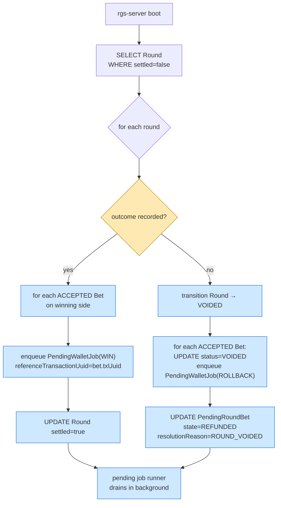
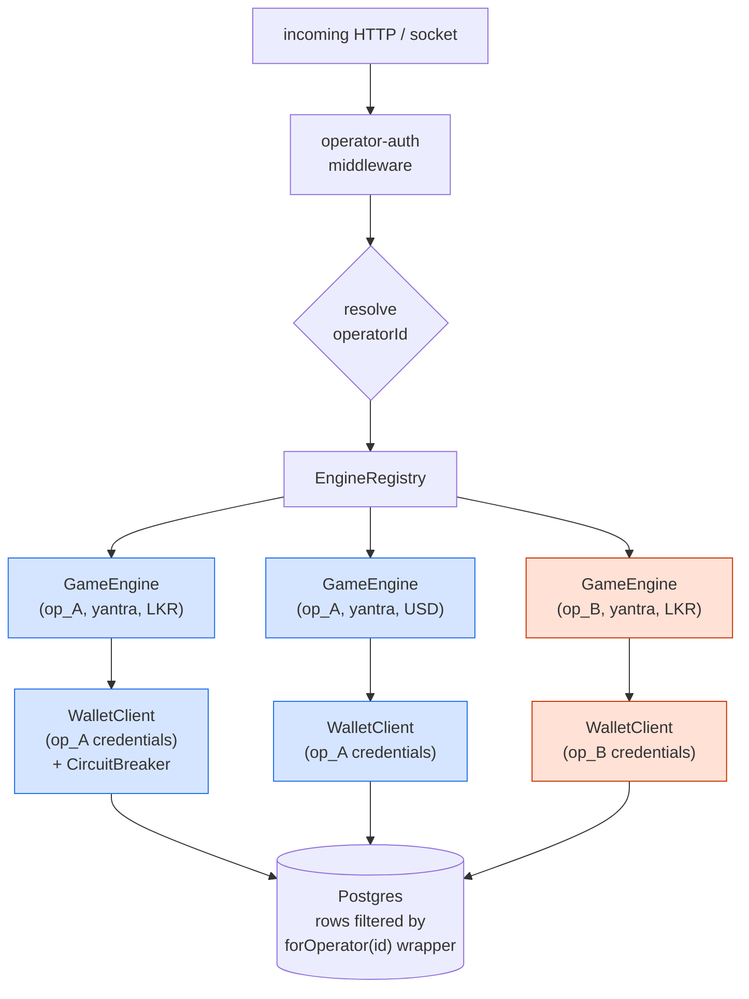
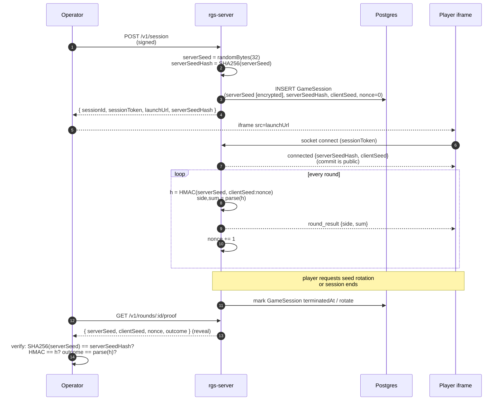
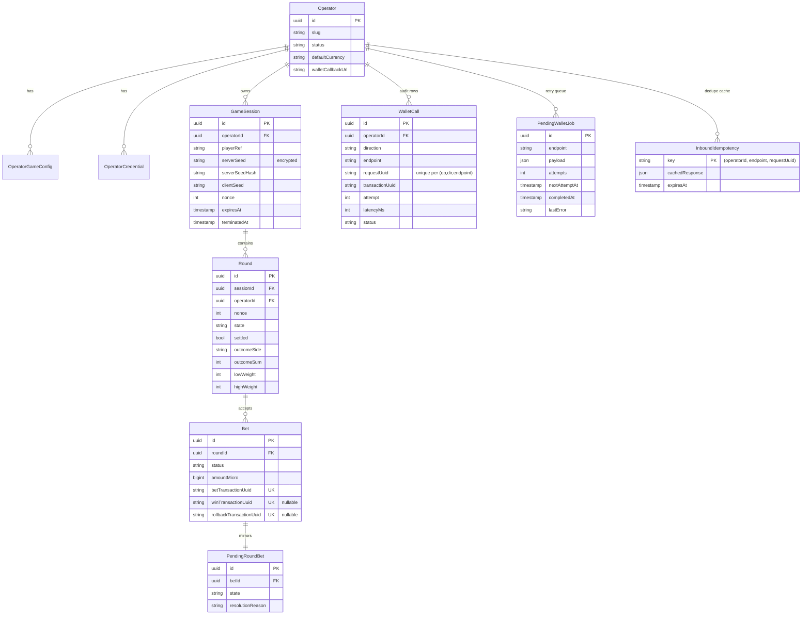

# Architecture Diagrams

> Renders natively in GitHub via Mermaid. For PDF/PNG export (cert-lab
> submissions, printed runbooks) pipe through `mmdc` (Mermaid CLI):
>
> ```bash
> npx @mermaid-js/mermaid-cli -i docs/architecture.md -o docs/architecture.pdf
> ```

**Companions:**

- [B2B_ROADMAP.md §4](../B2B_ROADMAP.md#4-reference-architecture), narrative architecture context.
- Per-game `games/<code>/docs/game-rules.md`: round lifecycle behaviour (e.g. [games/ketapola-dice/docs/game-rules.md](../games/ketapola-dice/docs/game-rules.md)).
- Per-game `games/<code>/docs/rng-spec.md`: outcome derivation (e.g. [games/ketapola-dice/docs/rng-spec.md](../games/ketapola-dice/docs/rng-spec.md)).
- [security.md](./security.md), signing, threat boundaries.

---

## 1. System context (C4 level 1)

Yantra Gaming sits as a game provider between operators and players.



**Trust boundaries:**

- The RGS trusts HMAC-signed inbound operator calls (±30s timestamp window,
  constant-time compare).
- The operator trusts HMAC-signed outbound wallet calls (same scheme, reversed
  credentials).
- The player trusts the RGS for game state *and* trusts the commit-reveal
  scheme to verify any disputed outcome.

---

## 2. Container view (C4 level 2)

> All components shown, backend, mock-operator, SDK, spec, and the
> reference `game-client` / `operator-portal` frontends, ship in this
> repository. The backend wire contract is the only surface bound by the
> SLA; the frontends are reference implementations operators can run,
> white-label, or replace. See
> [B2B_ROADMAP.md §1 "Product surfaces"](../B2B_ROADMAP.md#1-what-this-is).



---

## 3. Round lifecycle state machine

```mermaid
stateDiagram-v2
    [*] --> PENDING: engine tick
    PENDING --> BETTING_OPEN: seed snapshot,<br/>round row created
    BETTING_OPEN --> ROLLING: betting window expires
    ROLLING --> RESULT: rng.determineOutcome<br/>outcome persisted
    RESULT --> SETTLED: Round.settled=true;<br/>failed /wallet/win calls<br/>handed off to PendingWalletJob
    BETTING_OPEN --> VOIDED: operator /terminate<br/>OR crash recovery<br/>(outcome unknown)
    ROLLING --> VOIDED: unrecoverable RNG error<br/>(defensive; should not occur)
    VOIDED --> [*]: all bets rolled back
    SETTLED --> [*]
```



State labels align 1:1 with `Round.state` values in the Prisma schema.
See each game's `games/<code>/docs/game-rules.md §2` (e.g. [games/ketapola-dice/docs/game-rules.md](../games/ketapola-dice/docs/game-rules.md#2-round-lifecycle)) for timing.

---

## 4. Bet-to-settlement sequence

The full happy path, one bet, one round, one settlement, with the
idempotency keys called out.

```mermaid
sequenceDiagram
    autonumber
    participant P as Player iframe
    participant R as rgs-server
    participant DB as Postgres
    participant W as Operator wallet

    P->>R: place_bet(side, amountMicro)
    R->>DB: INSERT WalletCall<br/>(BET, requestUuid, txUuid, attempt=1)<br/>[before HTTP]
    R->>W: POST /wallet/bet<br/>{requestUuid, transactionUuid=txUuid,<br/>amountMicro, roundId}
    W-->>R: 200 {status: RS_OK, balanceMicro}
    R->>DB: UPDATE WalletCall set response
    R->>DB: INSERT Bet (status=ACCEPTED, txUuid)<br/>INSERT PendingRoundBet (state=HELD)
    R-->>P: bet_placed
    R-->>P: balance_update

    Note over R: … betting window expires …

    R->>R: outcome = determineOutcome(<br/>serverSeed, clientSeed, nonce, weights)
    R->>DB: UPDATE Round set outcome
    R-->>P: round_result {side, sum}

    alt bet is a winner
        R->>DB: INSERT WalletCall<br/>(WIN, newTxUuid, refTxUuid=bet.txUuid)
        R->>W: POST /wallet/win<br/>{referenceTransactionUuid=bet.txUuid}
        W-->>R: 200 {RS_OK, balanceMicro}
        R->>DB: UPDATE Bet set status=SETTLED<br/>UPDATE PendingRoundBet state=RESOLVED
        R-->>P: balance_update
    else bet is a loser
        R->>DB: UPDATE Bet set status=SETTLED<br/>(no /win call; stake already lost)
    end

    R->>DB: UPDATE Round set settled=true
```

**Notes on the shape:**

- Every outbound wallet call is journalled **before** the HTTP request fires
  (step 2, step N). On process death mid-call the row exists on restart ,
  crash recovery (§6) can resolve it.
- The `transactionUuid` on `/wallet/win` references the originating bet's
  `transactionUuid`. Operators use this to match credits to debits.
- A duplicate `requestUuid` from the operator retrying the same HTTP request
  hits the `InboundIdempotency` cache and returns the cached response,
  without re-invoking the handler.

---

## 5. Wallet-call retry + rollback decision

```mermaid
flowchart TD
    start["wallet.bet(txUuid)"] --> call["POST /wallet/bet"]
    call --> resp{"response?"}
    resp -- "RS_OK" --> ok["accept bet
    → INSERT Bet, PendingRoundBet"]
    resp -- "RS_ERROR_DUPLICATE_TRANSACTION" --> dup["treat as RS_OK
    (operator already processed)"]
    resp -- "RS_ERROR_NOT_ENOUGH_MONEY
    RS_ERROR_LIMIT_REACHED
    RS_ERROR_USER_DISABLED" --> reject["clean reject
    → emit bet_rejected
    (no rollback, no retry)"]
    resp -- "timeout
    5xx
    network error
    unknown RS_*" --> uncertain["uncertain outcome
    → enqueue rollback(txUuid)
    → emit bet_rejected"]
    uncertain --> retry[("PendingWalletJob
    exponential backoff
    attempts logged in WalletCall")]
    retry --> rbcall["POST /wallet/rollback
    (same txUuid)"]
    rbcall --> rbresp{"response?"}
    rbresp -- "RS_OK
    RS_ERROR_DUPLICATE_TRANSACTION
    RS_ERROR_TRANSACTION_DOES_NOT_EXIST" --> rbok["mark completed
    (operator cleaned / never had it)"]
    rbresp -- "other" --> rbretry["increment attempts
    alert if > 5min stuck"]
    rbretry --> retry

    classDef ok fill:#ccf2d4,stroke:#2d7a4b;
    classDef err fill:#ffd7d7,stroke:#a32a2a;
    classDef retry fill:#ffe9b3,stroke:#b88700;
    class ok,dup,rbok ok;
    class reject err;
    class uncertain,retry,rbcall,rbretry retry;
```

Classifier rules are tabulated in
[wallet-api.md](./wallet-api.md) and
[error-codes.md](./error-codes.md).

---

## 6. Crash recovery

On startup, the engine scans `Round` rows with `settled=false`:



**Invariants preserved:**

- No bet is settled twice (dedupe by `winTransactionUuid` unique constraint).
- No winner is dropped (every ACCEPTED bet either settles or refunds).
- No stake is kept on a voided round (every voided bet has a ROLLBACK
  enqueued).

See `tests/integration/settlement-failure.spec.ts` for the regression test
that exercises this path.

---

## 7. Multi-tenant isolation

One process. N operators. No global state crosses tenant lines.



**Isolation levers:**

1. `forOperator(id)` Prisma wrapper, every read and write is scoped to the
   tenant. Centralised so no query can forget it.
2. Per-operator `GameEngine` instance keyed on `(operatorId, gameCode, currency)`.
3. Per-operator `WalletClient` with its own `CircuitBreaker`: one
   misbehaving operator cannot drag down rounds for another.
4. Per-operator rate-limit middleware.
5. Per-operator IP allow-list (optional).
6. Per-operator session JWT `operatorId` claim, enforced in socket middleware.

---

## 8. Provably-fair commit-reveal (seed lifecycle)



See each game's RNG spec (e.g. [games/ketapola-dice/docs/rng-spec.md](../games/ketapola-dice/docs/rng-spec.md)) and
[provably-fair.md](./provably-fair.md).

---

## 9. Data model: the money-path tables



Full schema in `apps/rgs-server/prisma/schema.prisma`.

---

## 10. Exporting to PDF / PNG

For cert-lab submissions that require non-interactive diagrams:

```bash
# One-off PDF export of this entire doc
bunx @mermaid-js/mermaid-cli -i docs/architecture.md -o /tmp/architecture.pdf

# Per-diagram PNG (extract each ```mermaid block first)
# Example: extract §3 state machine into a standalone .mmd, then:
bunx @mermaid-js/mermaid-cli -i /tmp/round-state.mmd -o /tmp/round-state.png -w 1600
```

The licensee may prefer a design tool (draw.io, Excalidraw) for submission
copies, this document remains the source of truth, and those copies should
re-render the diagrams from the Mermaid source to avoid drift.
